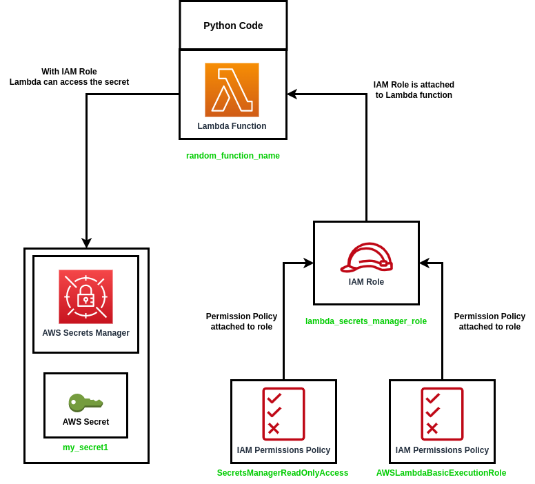

## Table of Contents

- [Introduction](#introduction)
- [Instructions (Click here to skip the explanations)](#instructions)
- [Notes](#notes)

## Introduction

A $\textcolor{orange}{\textsf{common pattern}}$ I see when investigating lambda functions that folks create is that they reference $\textcolor{orange}{\textsf{plaintext secret keys in the Lambda environment variables}}$.  This is $\textcolor{orange}{\textsf{not a secure pattern}}$ and we should always be storing our secrets in an appropriate secrets store such as AWS Secrets Manager or AWS Systems Manager Parameter Store.  $\textcolor{orange}{\textsf{This lab will guide you through the implmentation of utilizing AWS Secrets Manager secrets through a lambda function with python code.}}$  In addition to simply utilizing the secret, we also add a Lambda Layer which allows us to cache the secret, therefore we're not making an API call to secrets manager every time, reducing cost.

### Instructions
1. Review the picture of how this lab functions
2. Review the terraform code associated with this lab
3. Review the python code associated with this lab
4. Deploy the Terraform code
5. Test the lambda function and retrieve the secret!

### Pre-requsites
1. Have an AWS account in which you have access to create resources and manage IAM
2. Have terraform installed on your local system [Terraform install docs](https://developer.hashicorp.com/terraform/tutorials/aws-get-started/install-cli)S
3. Have AWS CLI installed on your local system to configure your access and secret keys [AWS CLI Install docs](https://docs.aws.amazon.com/cli/latest/userguide/getting-started-install.html)

### Step 1: Review the picture of how this deployment functions
Below you'll find an image of how this lab functions!  Review the diagram and attempt to understand how it will all fit together.



### Step 2: Review the terraform code associated with this lab
Note the various terraform files and setup for this lab.  We create a custom IAM policy that allows the get and list permissions from secrets manager.  The other IAM policy is a pre-made IAM policy for a basic Lambda Execution Role.  We take those policies and associate them to the custom role "lambda_role".

We also create a secret in secrets manager as well as associate the python code to the lambda function.  Note, if you want to assign python code to the Lambda function you need to zip it into a .zip file first.  There is also a very important configuration setting in the deployment of this lambda function.  You'll see that there is a $\textcolor{blue}{\textsf{"layers" configuration setting}}$ on the Lambda function.  This is $\textcolor{blue}{\textsf{VERY IMPORTANT}}$ to the deployment of the lambda function as if you don't include the layer ARN from your account, the lambda function will not execute properly.


### Step 3: Review the python code associated with this lab
In the python code you'll notice that we define a few key elements.

To retrieve secrets from the extension cache, you first need to add the X-AWS-Parameters-Secrets-Token to the request header. Set the token to AWS_SESSION_TOKEN, which is provided by Lambda for all running functions. Using this header indicates that the caller is within the Lambda environment.
```
headers = { "X-Aws-Parameters-Secrets-Token": os.environ.get('AWS_SESSION_TOKEN') }
```

Then we make a GET request to the cache so to do that we define the localhost, the port, the cred path, and then make the GET request.
```
# define the credential name
creds_path = "my_secret1"

# define the port
port = os.environ['PARAMETERS_SECRETS_EXTENSION_HTTP_PORT']

# define the localhost URL
url = ('http://localhost:' + port + url)

# make the request
response = http.request("GET", url, headers=headers)
response = json.loads(response.data)

# create url
secrets_url = ('/secretsmanager/get?secretId=' + creds_path)
```

For more information on how to integrate the new layer into your lambda function, please refernece this documentation
[AWS Documentation](https://docs.aws.amazon.com/secretsmanager/latest/userguide/retrieving-secrets_lambda.html)

### Step 4: Deploy the terraform code
The first thing you'll need to do is get your layer ARN.  You can find this by creating a test lambda function and adding the "AWS Parameters and Secrets Lambda Extension" layer and then copy the ARN and paste it into the "lambda.tf" file where it states "layers".

Then you can run the following terraform commands:
```hcl
terraform init
terraform fmt
terraform validate
terraform apply
```

### Step 5: Test the lambda function and retrieve the secret!
Test the lambda function by going into your AWS account and clicking into the Lambda function and click into the code tab and click "Test"!


### Notes
* Because of the critical nature of secrets, AWS Secrets Manager intentionally makes deleting a secret difficult. Secrets Manager does not immediately delete secrets. Instead, Secrets Manager immediately makes the secrets inaccessible and scheduled for deletion after a recovery window of a minimum of seven days. Until the recovery window ends, you can recover a secret you previously deleted. There is no charge for secrets that you have marked for deletion. 
* If the secret is encrypted with a customer managed key instead of the AWS managed key aws/secretsmanager, the execution role also needs kms:Decrypt permission for the KMS key.
* Because there is a cost for calling Secrets Manager APIs, using a cache can reduce your costs.
* The new AWS Parameters and Secrets Lambda extension provides a managed parameters and secrets cache for Lambda functions. The extension is distributed as a Lambda layer that provides an in-memory cache for parameters and secrets. It allows functions to persist values through the Lambda execution lifecycle, and provides a configurable time-to-live (TTL) setting.