## Table of Contents ()

- [Introduction](#introduction)
- [Pre-requisites](#pre-requisites)
- [Before you begin](#beforeyoubegin)
- [Instructions (Click here to skip the explanations)](#instructions)
- [Notes](#notes)

## Introduction

This lab is intended to teach you how to properly $\textcolor{orange}{\textsf{restrict access to the Microsoft Entra ID (formerly Azure AD) portal}}$.  In Entra ID, all users are granted a set of default permissions.  One of those permissions is viewing the Entra administration portal which allows you to enumerate users, groups, application registrations, enterprise applications, some tenant settings etc.  Microsoft states that $\textcolor{orange}{\textsf{enabling this setting is NOT a security measure}}$ and I somewhat agree with them.  Enabling this setting ONLY is simply a $\textcolor{orange}{\textsf{"security by obscurity"}}$ route which is not effective to even low skilled attackers.  However, to the lowly person in X department who is trying to do information gathering to be a low level insider threat, even simple methods of prevention to portal access will be a nice blocker to prevent reconnisannce.  The reason this would be a security by obscurity setting is because of exactly this statement by Microsoft "It doesn't restrict access to Microsoft Entra data using PowerShell, Microsoft GraphAPI, or other clients such as Visual Studio.  It doesn't restrict access as long as a user is assigned a custom role (or any role)."

However, coupling this setting with a $\textcolor{orange}{\textsf{Conditional Access Policy (CAP), IS an effective method}}$  at preventing attackers from easy/frutiful reconnissance.  In this lab we will discuss three methods to securing access to your Entra Administration portal.

Level 1: Enablement of only the "Restrict access to Microsoft Entra administration portal" setting
Level 2: Enablement of the "Restrict access to Microsoft Entra administration portal" setting AND a Conditional Access Policy
Level 3: Enablement of the "Restrict access to Microsoft Entra administration portal" setting, a Conditional Access Policy AND Dynamic group membership rules

### Pre-requisites
1. Microsoft Entra Tenant
2. Global Administrator Access (verification needed)
3. One user with a Entra P1 license
4. (Later) User attributes in their properties
5. A plan to deploy in production (if desired)

### Before you begin
Please do not simply deploy this setting into production with no editing / configuration changes.  I take no responsibility for you deploying insecure resources and losing data.

There are a few things you'll need to consider when configuring this setting:
* Users will NOT be able to view / manage application registrations or enterprise applications when this setting is enabled
* For level 3, users will need to have attributes in their properties to build a dynamic group upon
* There are plenty of ways to enumerate, discovery, perform reconnisance in an Azure environment, so please do not treat level 3 as an "end all be all" security setting


### Instructions
Rather than traditional instructions, think of the following information mainly as a set of considerations when deploying this setting in your tenant.

First, i've created a test user in my tenant called "newportaluser".  This user will serve as our test user in identifying what happens when we enable the setting and what permissions users have by default.
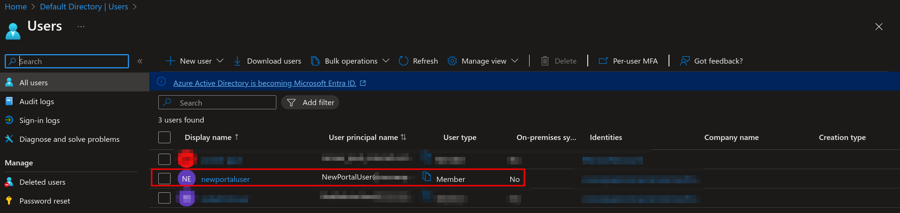

If you see here, this user has no directly assigned roles.
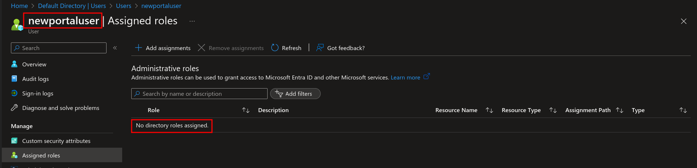

However, as you can see this user can identify some basic settings about my tenant, users, groups, etc
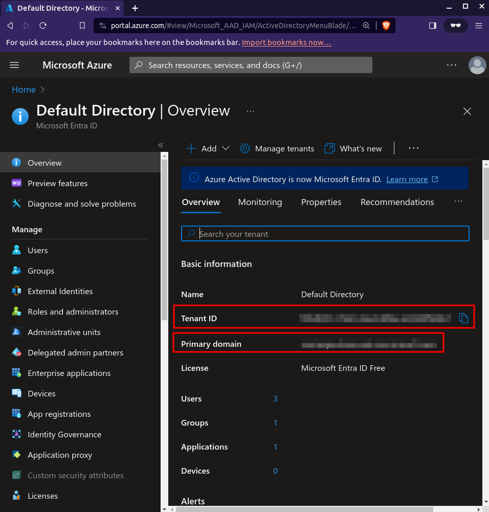
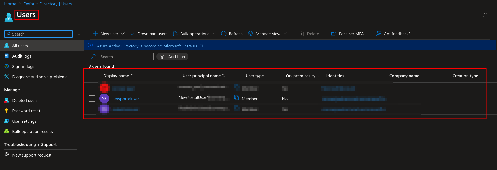
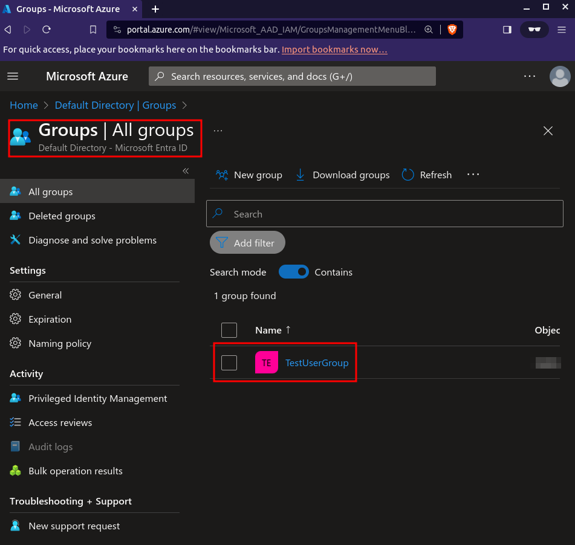
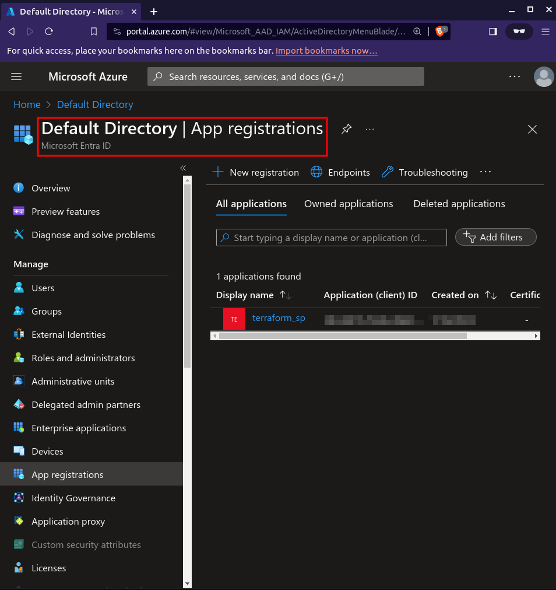

As a user with no permissions, I can even identify the secret IDs within the Application Registration!
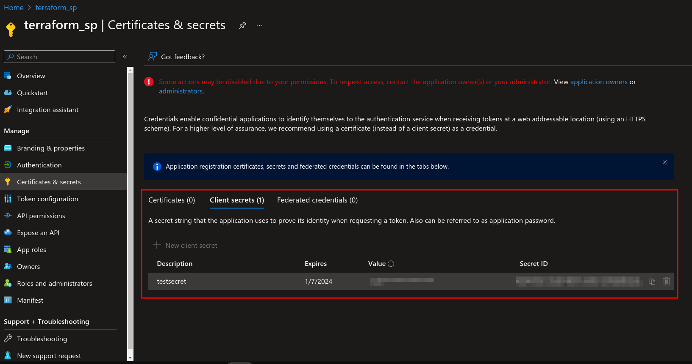

For a full list of default user permissions please see this article by Microsoft

* [Default User Permissions](https://learn.microsoft.com/en-us/azure/active-directory/fundamentals/users-default-permissions)

Nonetheless, the default user permissions are overly permissive from a reconnissance standpoint.

Now, you'll see once I enable this setting "Restrict access to Microsoft Entra ID administration portal", I'll lose access to the portal..
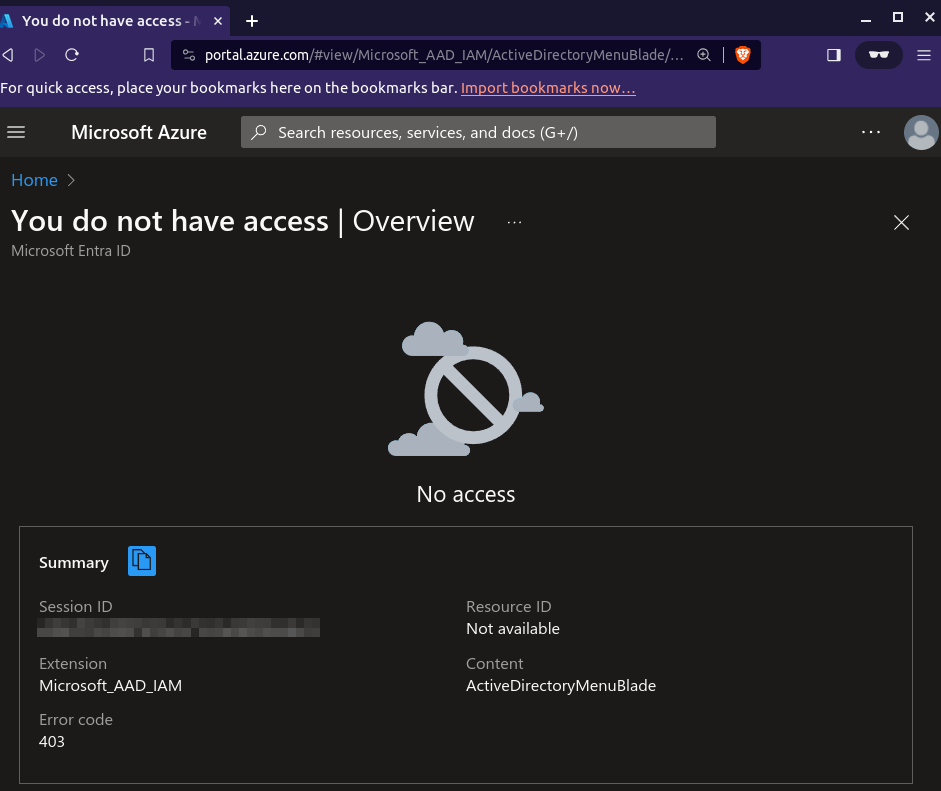

If you ONLY configure the setting to "Restrict access to Microsoft Entra ID administration portal" and you don't pair it with a conditional access policy, you'll end up with the below result.

Here are a few discovery commands run with the block portal access setting enabled.

For reference here are the commands you can run yourself.  For a list of awesome enumeration commands utilizing an authenticated user please reference this [guide](https://github.com/0xJs/CARTP-cheatsheet/blob/main/Authenticated-enumeration.md#Enumeration-using-AzureAD-Module)

```
# Get all Azure AD (Entra ID) users
az ad user list --output table

# Search for admin users
az ad user list | ConvertFrom-Json | %{$_.displayName -match "admin"}

# Get all the application objects registered with the current tenant
az ad app list --query "[].[displayName]" -o table

# List tenant id
az account tenant list
```

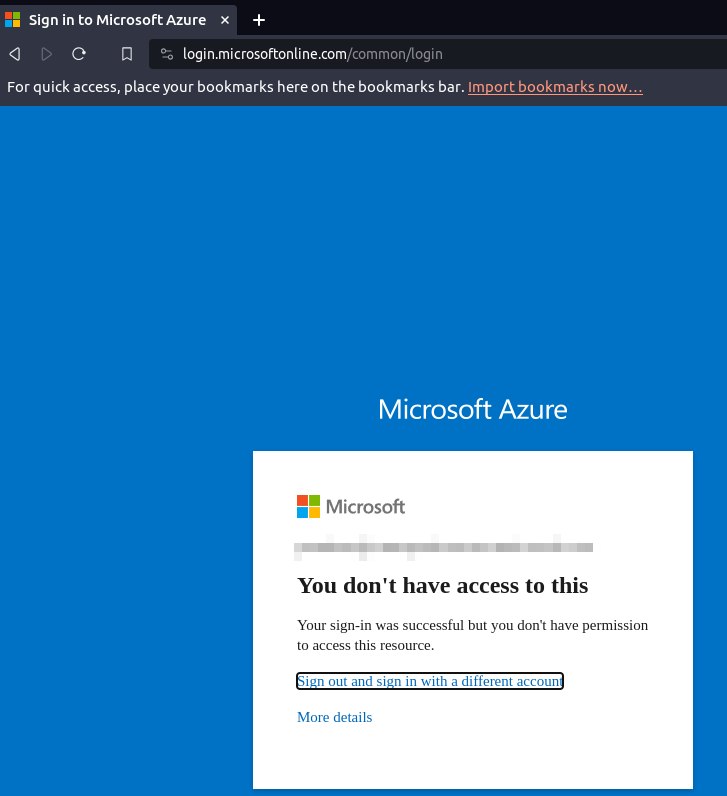
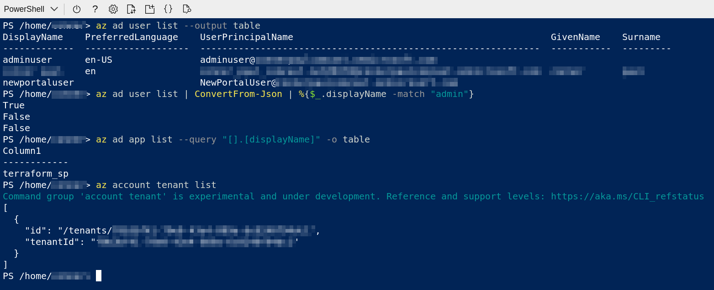

Now, if we pair a conditional access policy along with this setting we'll get a much more locked down experience.  As you can see, I wasn't even allowed to start up an Azure CLI session with this conditional access policy applied.

Note in this case, due to me not having an abundance of P1/P2 licenses I applied the setting just to 1 user, but in actuality you'd want to apply this to all of your users in your tenant.
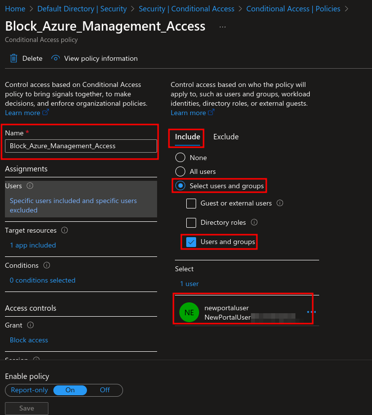

The key thing I want to note in this screenshot is that you want to exclude the "Directory Reader" role.  This will give your users that basic level of access they need to get to the portal, checkout PIM roles, and perform their job functions.


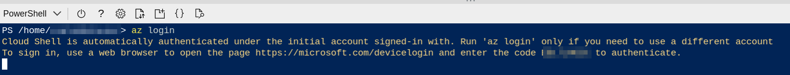
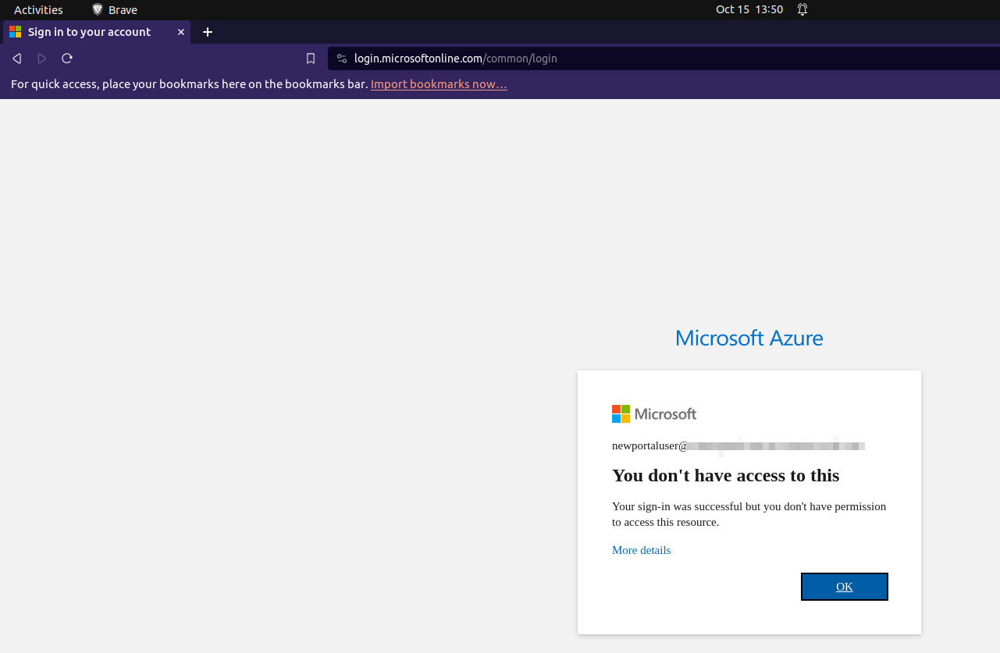

For reference here are all of the things you will have blocked with this conditional access policy.
[blockeditems](https://learn.microsoft.com/en-us/azure/active-directory/conditional-access/concept-conditional-access-cloud-apps#microsoft-azure-management)

You might be thinking "Great!  Now how do I apply access to the users that actually need access without having to manually add someone to a group every time?".  Well the answer to that question is dynamic membership rules!

The way that we're going to apply access to users who need access is going to require a specific set of pre-reqs that might make you say "This is not the setting for me!".
* Required access users will always have to have a statically assigned "Directory Reader" role assigned via groups (no PIM assignment because when users are not able to access the portal, they cannot access PIM either since it is contained within the portal)
* Specific attributes on each user's properties to build the dynamic group upon

These two pre-reqs are very important to the deployment of this strategy

As you can see here, I've built a dynamic group that defines who needs access to the Azure Management Plane.

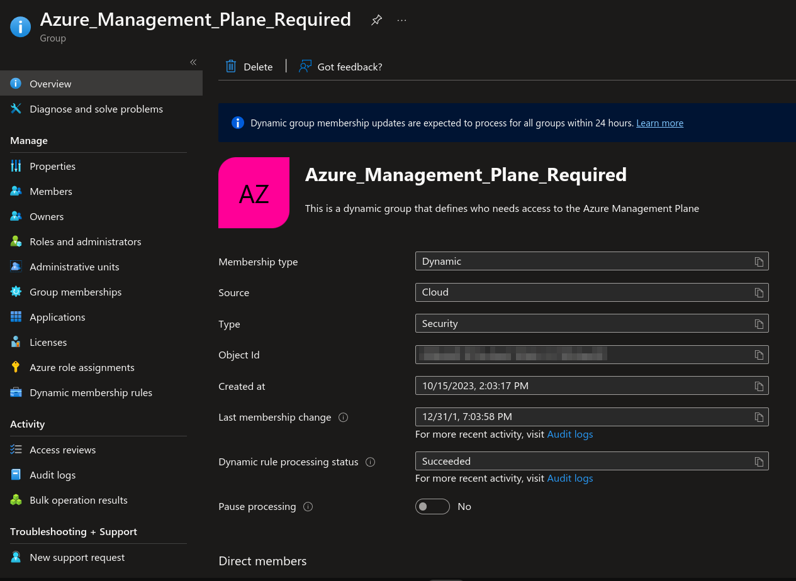
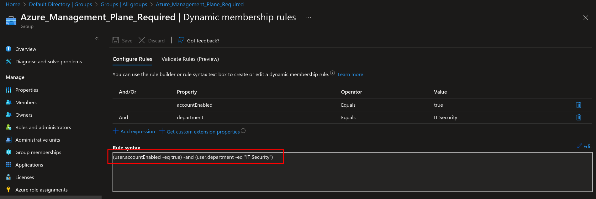

NOTE: When you deploy level 2 or 3 you will need to statically assign users/groups who need access to the portal with the directory reader setting.  If your organization utilizes PIM you'll notice that this advise goes directly against typical advice of putting all roles under PIM.  However, if you attempt to deploy level 2 or 3 and you do not assign directory reader to the users they will be unable to get to the PIM portal to checkout any of their roles.

Level 1: Enablement of only the "Restrict access to Microsoft Entra administration portal" setting
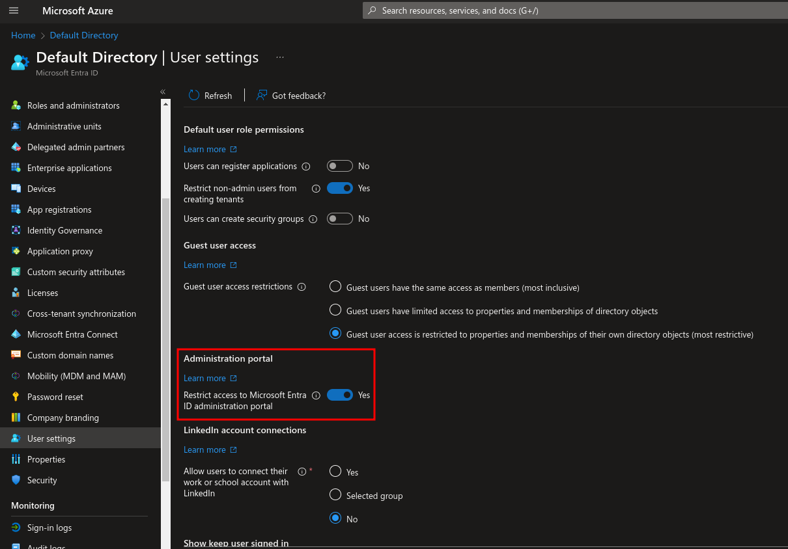

Level 2: Enablement of the "Restrict access to Microsoft Entra administration portal" setting AND a Conditional Access Policy

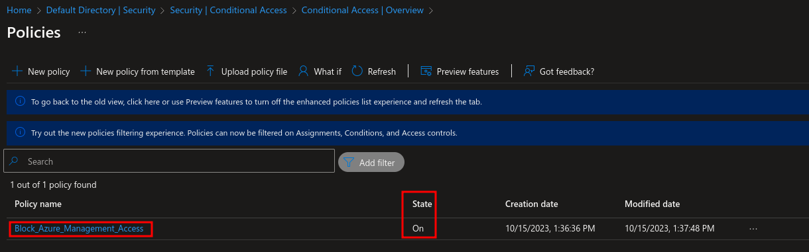

Level 3: Enablement of the "Restrict access to Microsoft Entra administration portal" setting, a Conditional Access Policy AND Dynamic group membership rules


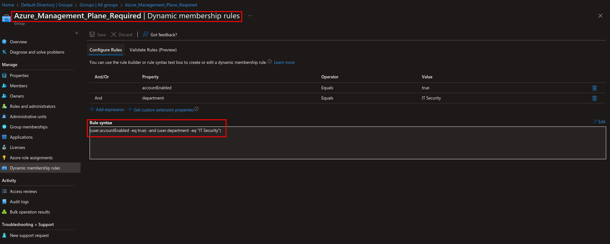

Thank you for joining me on this lab experience and if you enjoyed please feel free to follow :) 