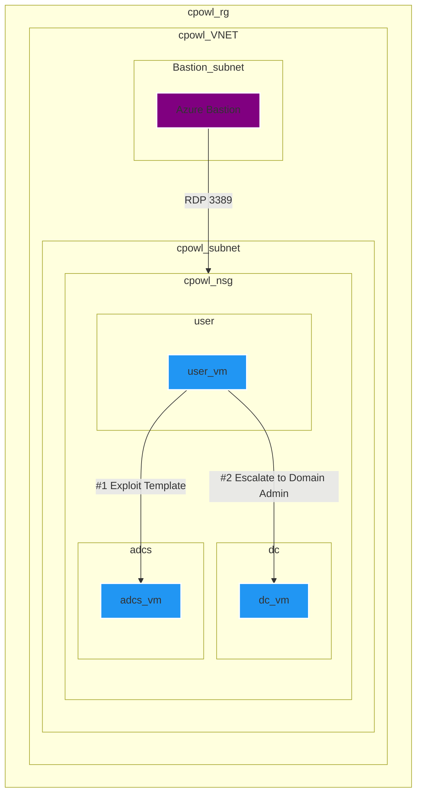

```mermaid
graph TD;
  subgraph cpowl_rg
  subgraph cpowl_VNET
    subgraph Bastion_subnet
      H[Azure Bastion]
      style H fill:#800080,stroke:#FFF,stroke-width:2px;
    end
    subgraph cpowl_subnet
      subgraph cpowl_nsg
        subgraph dc
          A[dc_vm];
        end
        subgraph adcs
          C[adcs_vm];
        end
        subgraph user
          E[user_vm];
        end
      end
      
      style A fill:#2196F3,stroke:#FFF,stroke-width:2px;
      style C fill:#2196F3,stroke:#FFF,stroke-width:2px;
      style E fill:#2196F3,stroke:#FFF,stroke-width:2px;

      H-->|RDP 3389|cpowl_nsg
      E -->|#1 Exploit Template|C
      E -->|#2 Escalate to Domain Admin|A
      end
    end
  end


```